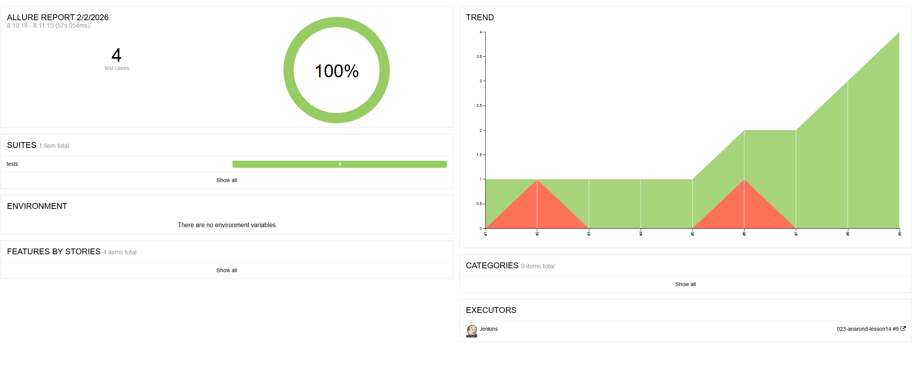
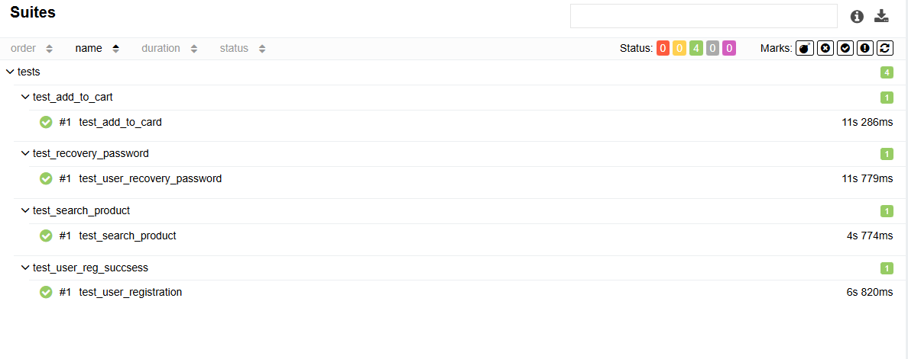
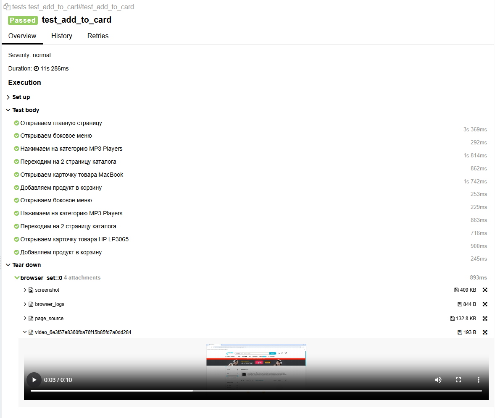
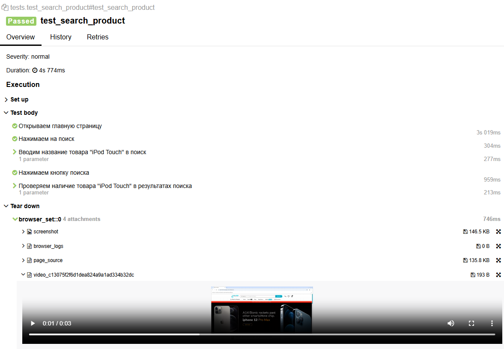
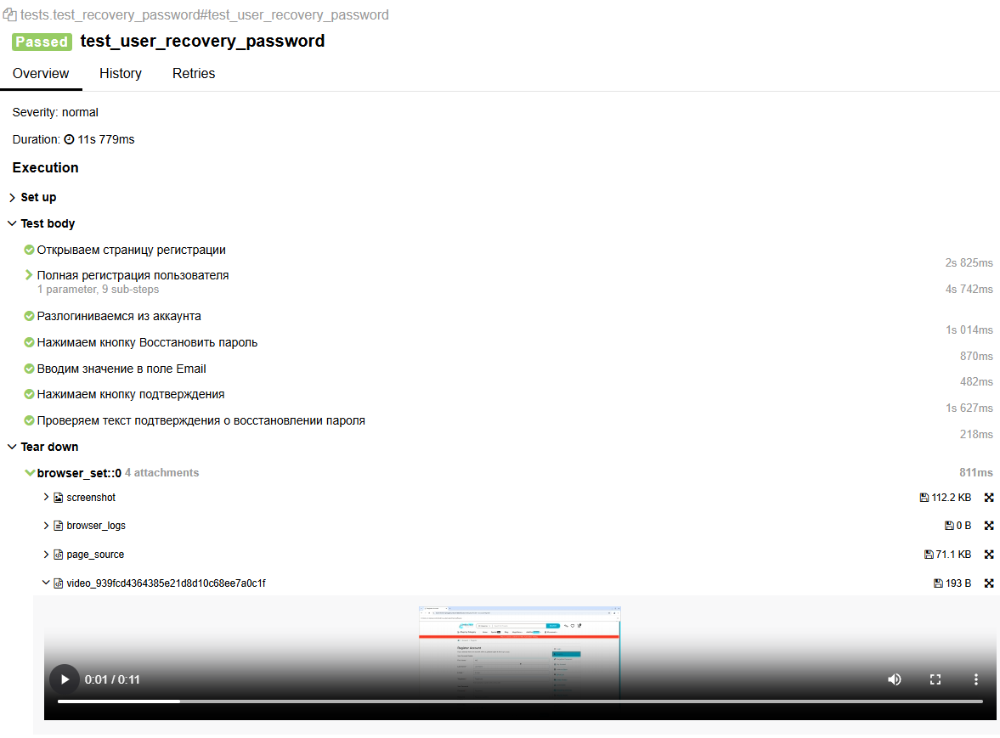
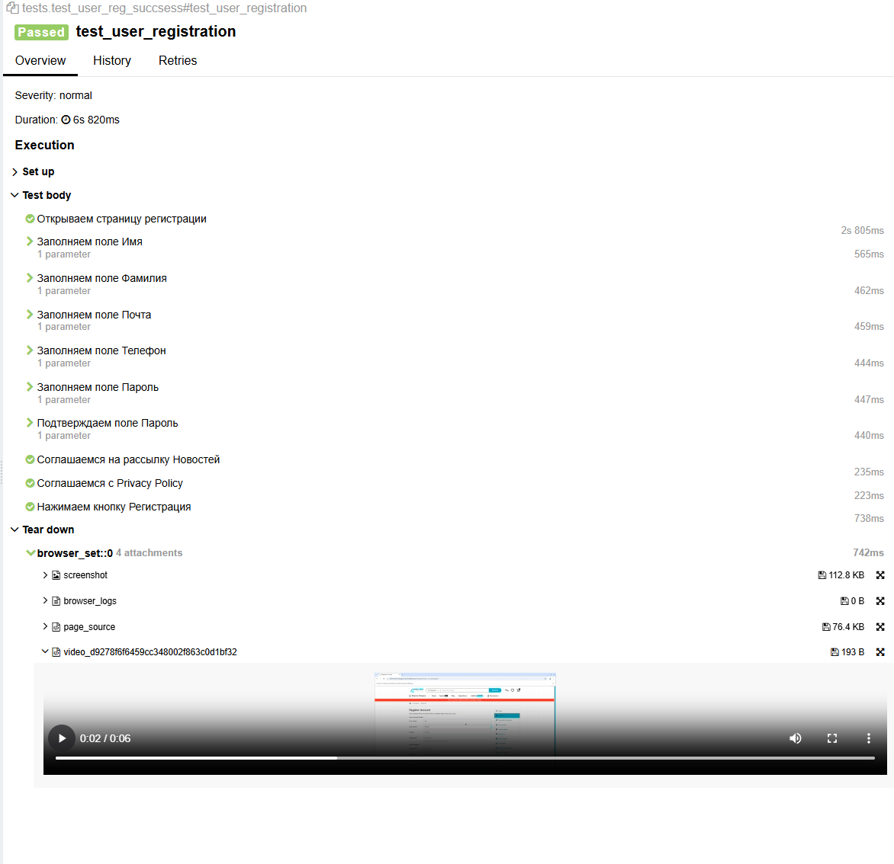
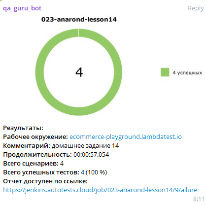

# 🚀 E-commerce UI Automation Project

Проект по автоматизации тестирования учебного интернет-магазина. В основе лежит подход **Page Object Model (POM)**, обеспечивающий чистоту кода и легкость поддержки тестов.

---

## 🎯 Объект тестирования
Тесты написаны для сайта: **[LambdaTest Ecommerce Playground](https://ecommerce-playground.lambdatest.io/)** — современный веб-магазин с динамическими элементами и сложной навигацией.

## 🛠 Технологический стек
Проект построен на актуальном наборе инструментов:
* **Selene** — "User-oriented" обертка над Selenium (аналог Selenide для Python).
* **Pytest** — фреймворк для запуска и организации тестов.
* **Allure Report** — визуализация результатов с шагами и скриншотами.
* **Faker** — генерация уникальных данных для регистрации.
* **Selenoid** — запуск браузеров в Docker-контейнерах.
* **Python-dotenv** — управление конфигурацией через `.env`.

## ✅ Покрытый функционал
На данный момент автоматизированы следующие сценарии:

### 👤 Регистрация пользователя
* Создание уникального аккаунта с использованием **Faker**.
* Взаимодействие с формами, чекбоксами и радиокнопками.
* Валидация успешного завершения регистрации.

### 🛒 Работа с корзиной и каталогом
* Навигация по категориям и работа с **пагинацией**.
* Выбор товаров.
* Добавление товаров в корзину.

## 📊 Отчетность
Каждое действие логируется с помощью `@allure.step`. В отчете доступны:
1. Подробные шаги выполнения.
2. Скриншоты, логи, видео.

### 📸 Пример отчета Allure

